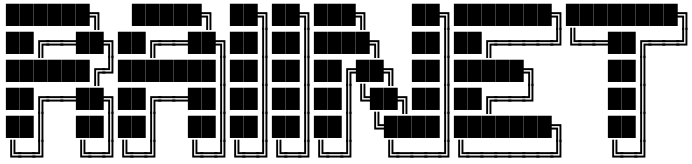
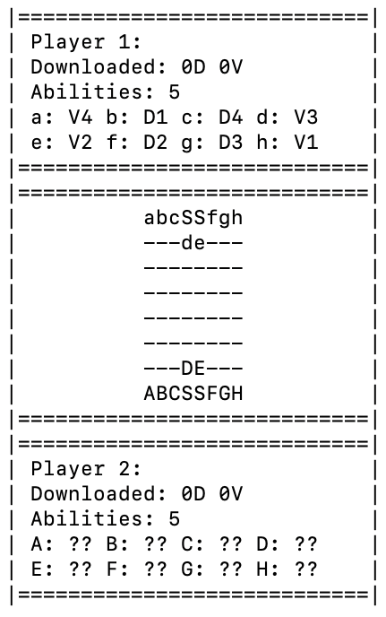
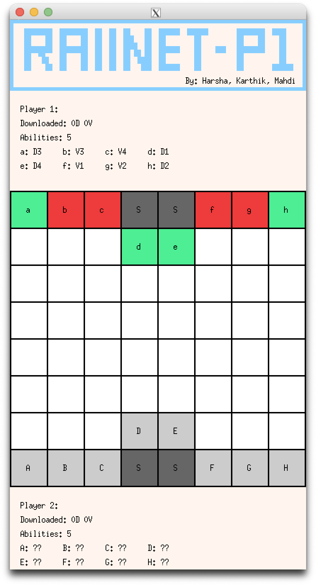
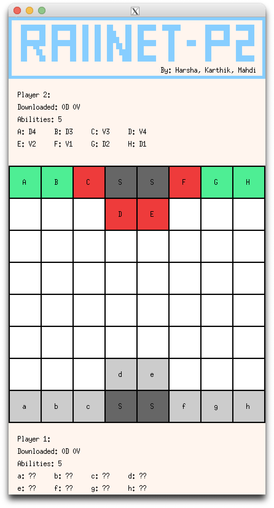

<h1> RAIInet </h1>

RAIInet is a video game inspired by Stratego. It is a game played between two opposing players, who play the role of computer hackers. Each player controls 8 pieces, called links. There are two different kinds of links: viruses and data. Players have the option to choose and apply a set of abilities during their move. The game ends when either of the players download 4 data or 4 viruses.

This game is well-structured and efficiently developed using OOP concepts and software design patterns. Our game incorporates the single as well as the dual displays feature (each tailored to the perspective of either Player 1 or Player 2) that offers a more refined and well-rounded experience.

<h2> Text Display </h2>

<h2> Graphics Display </h2>

<table>
<tr>
<td>
<strong>
Player 1 View:
</strong>
</td>
<td>
<strong>
Player 2 View:
</strong>
</td>
</tr>
  
<tr>
<td>

</td>
<td>

</td>
</tr>
</table>

<h2> Team </h2>

- Mahdi Raza Khunt
- Karthik Krishna Viriyala
- Harsha Puranik
